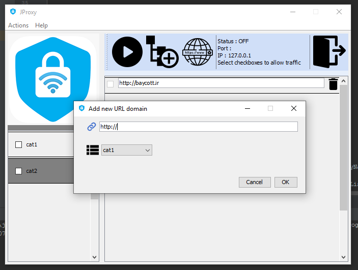

# Java Proxy Server
In this project, I implemented a proxy server that only allows URLs that are in category that was checked, for other URLs it sends you a page with 403 forbidden message.

It's a good example how to socket programming, multithreading and also GUI programming.
## How to use
You should go to internet setting (in windows 10) and in the connection tab press LAN Settings button in the right bottom of screen, then enable proxy usage and enter the IP and port number of this application that is running on it.

## Output
You can see the output below:

